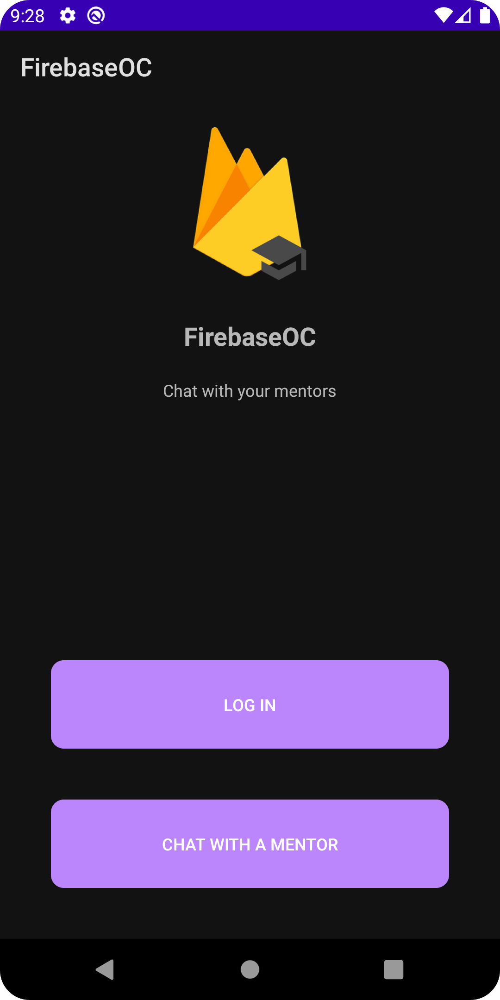
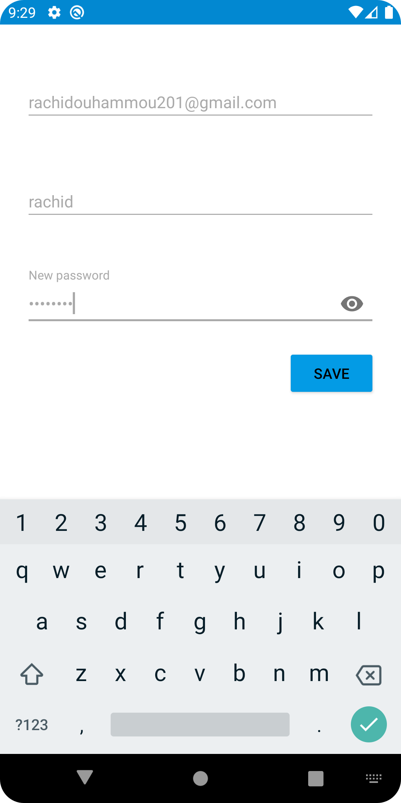
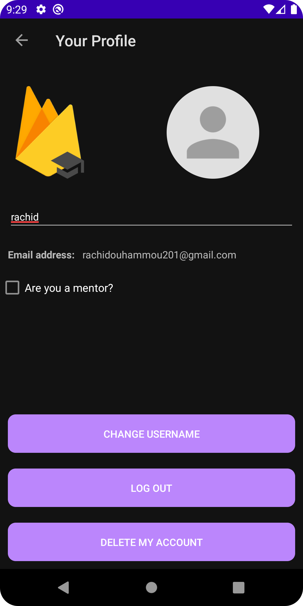
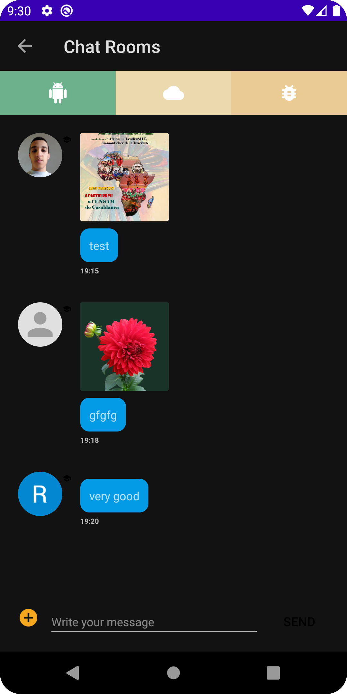
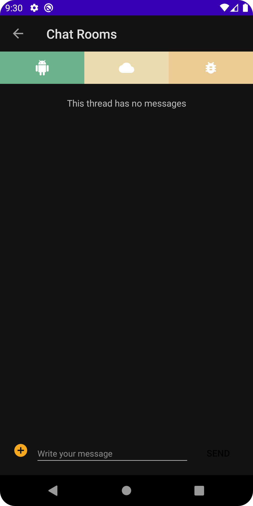

# FirebaseOC

FirebaseOC is a mini-app that demonstrates how to integrate Firebase into an Android app. With FirebaseOC, you'll learn how to create a backend for your Android app that supports authentication, real-time data storage, file sharing, and notifications.

## Features
![(https://github.com/ouhammmourachid/firebase-oc/actions/workflows/android.yml/badge.svg)]
(https://github.com/ouhammmourachid/firebase-oc/actions/workflows/android.yml)

- Firebase Authentication: Users can sign in using their email, Facebook, or Google credentials.
- Firebase Firestore: Real-time database for storing and retrieving data remotely.
- Firebase Storage: Storage for file sharing between users.
- Firebase Cloud Messaging: Push notifications for sending messages to users.

## Requirements

- Android Studio 4.1 or later.
- Android SDK 28 or later.
- Google Play services 19.0.0 or later.

## Installation

To install FirebaseOC, follow these steps:

1. Clone the repository from Github: `git clone https://github.com/ouhammmourachid/firebase-oc.git`
2. Open the project in Android Studio.
3. Connect your device or start an emulator.
4. Click on the Run button to build and run the app on your device.

## Usage

To use FirebaseOC, follow these steps:

1. Launch the app on your device.
2. Sign in using your email, Facebook, or Google credentials.
3. Add data to the database and watch it update in real-time.
4. Share files with other users.
5. Receive notifications when new data is added.

## Credits

FirebaseOC was developed by [Your Name] as part of the Android Developer Nanodegree program at Udacity.

## License

FirebaseOC is licensed under the [MIT License](https://opensource.org/licenses/MIT). See `LICENSE` for more information.

## Contact

If you have any questions or feedback, please contact [Your Name] at [youremail@email.com].

## Screenshots

    
    
    
    
    

## Contributing

If you'd like to contribute to FirebaseOC, please follow these steps:

1. Fork the repository.
2. Create a new branch for your feature or bug fix.
3. Make your changes and commit them with descriptive commit messages.
4. Push your changes to your fork.
5. Submit a pull request to the FirebaseOC repository with a clear description of your changes.

## Issues

If you find any issues with FirebaseOC, please report them on the [Github Issues page](https://github.com/ouhammmourachid/firebase-oc/issues).

## Acknowledgments

FirebaseOC was built using the following open-source libraries:

- Firebase Authentication
- Firebase Firestore
- Firebase Storage
- Firebase Cloud Messaging

## Conclusion

Thank you for checking out FirebaseOC! We hope this app helps you learn how to integrate Firebase into your Android apps. If you have any questions or feedback, please don't hesitate to contact us.
